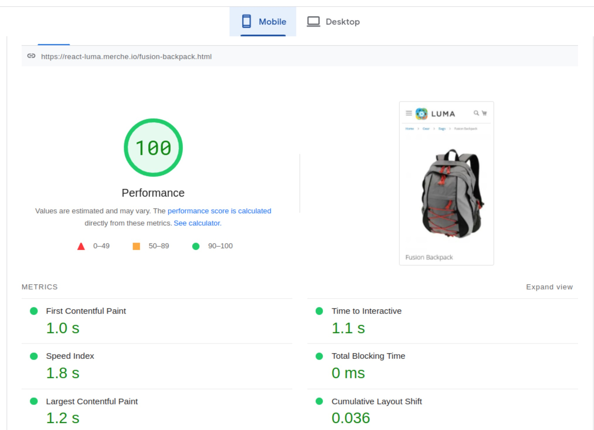
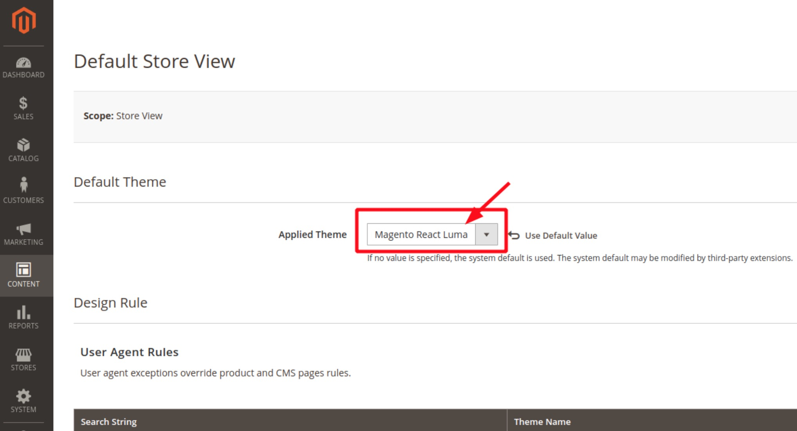
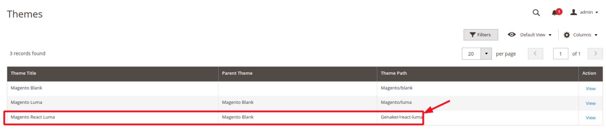

# Luma-React-PWA-Magento-Theme


### [View all Roadmaps](https://github.com/nholuongut/all-roadmaps) &nbsp;&middot;&nbsp; [Best Practices](https://github.com/nholuongut/all-roadmaps/blob/main/public/best-practices/) &nbsp;&middot;&nbsp; [Questions](https://www.linkedin.com/in/nholuong/)
<br/>


Blazing-Fast Default Magento Luma theme on ReactJS UI components PWA features with better front performance.

Luma React is a Free Open Source Theme that aims to resolve performance issues by removing all the awful introduced by Adobe Magento 2-based themes and starting with a blank HTML. The thousands of bloated junk JavaScript file libraries were replaced with no JS framework known as Vanilla JS, but you can add any JS framework additionally for your needs ReactJS, Vue.Js, Alpine.js. In addition, all CSS is optimized and not replaced. So you can basically convert your existing Magento junk theme to a fast theme.

# Performace improvements
After the Consultation with Erwin Hofman 

We made big improvements in the LCP metrics on Mobile. Now this theme even faster than before.



You can check Google Page Speed results here:

https://pagespeed.web.dev/report?url=https%3A%2F%2Freact-luma.merche.io%2Ffusion-backpack.html

# Installation 
```
 composer require genaker/theme-react-luma --ignore-platform-reqs
 mysql -e "select * from theme"
 bin/magento config:set --scope="default" "design/theme/theme_id" 4 #whatever id you have
```
or go to admin : 

Content -> Design -> Configuration

Apply theme:



Theme info:


clear the cache. 

# Dependencies:

Magento React Theme uses Magento React integration extension (https://github.com/nholuongut/magento2-reactapp/) as a dependency. Extension will be added automaticaly if to install via Composer.

For the best performace You shuld use:
* CSS optimiser tool: (not publicly available yet)
* Improved Magento FPC: (not publicly available yet)
* Magento Mictoservices: Laragento/Laragento, PyGento/Python3, NodeJento/NodeJS
* Magento Opcache React GUI: https://github.com/nholuongut/magento-2-opcache-gui
* PWA Magento Extension:https://github.com/nholuongut/magento-2pwa
* Magento Open Source Terraform AWS Cloud: https://github.com/nholuongut/aws-magento-2-cloud-Terraform-infrastructure-as-code

# 🚀 I'm are always open to your feedback.  Please contact as bellow information:
### [Contact ]
* [Name: nho Luong]
* [Skype](luongutnho_skype)
* [Github](https://github.com/nholuongut/)
* [Linkedin](https://www.linkedin.com/in/nholuong/)
* [Email Address](luongutnho@hotmail.com)


[](https://ko-fi.com/nholuong)

# License
* Nho Luong (c). All Rights Reserved.🌟
